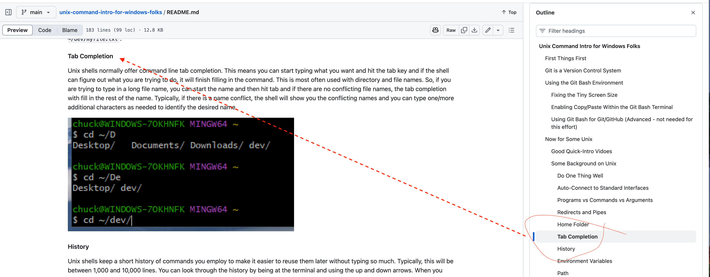

# How To Read a GitHub readme file with Table of Contents Navigation

## Click on the README.md file link in the online repo

## At the readme.md file view

## Collapse the File Tree on the Left

## Show the Outline on the Right

## Use the Outline to Navigate

Browse the Outline and click on the area you want to read.

